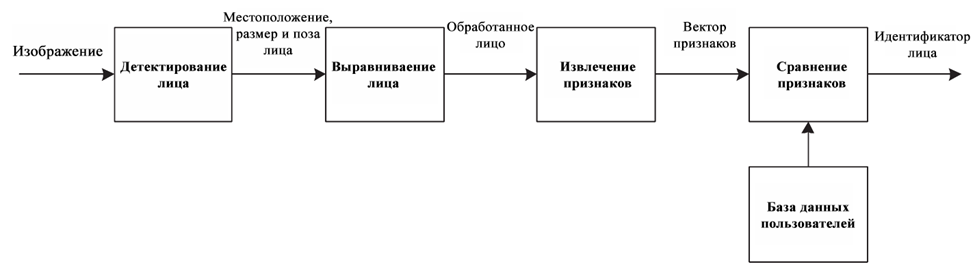

# Система контроля и управления доступом с использованием распознавания лиц на платформе raspberry pi

Этот проект является моей выпускной квалификационной работой на специальности: информационная безопасность автоматизированных систем. Задачей стояло реализовать систему, которая обрабатывала бы все изображения на месте, т.е. без использования серверных мощностей или облачных вычислений. Raspberry pi плохо подходит для работы с нейронными сетями. Однако компактность и низкая стоимость являлись главными критериями при выборе платформы. В связи с поставленными задачами и выбранной платформой у системы есть свои особенности, которые будут описаны ниже.

Результат итоговой работы

## Алгоритм системы

 1. На вход системе подается изображение. Его обрабатывает детектор, который пытается найти лицо нa нем. Если лицо не обнаружено, то изображение отбрасывается, иначе оно подается дальше вместе с прямоугольником, который наиболее точно описывает положение лица на изображении. Детекция происходит с помощью фронтального каскада Хаара, который реализован в библиотеке `OpenCV`. Главное достоинство каскада Хаара в его скорости обработки изображения. 
 2. Выравнивание лица преобразует полученное лицо в некоторое общее положение. Данная нормализация призвана облегчить работу подсистеме извлечения признаков. С помощью `shape_predictor`, который реализован в библиотекe `dlib`, ищутся основные точки лица: центры глаз, кончик носа, кончики губ. Далее с помощью афинного преобразования изображение изменяется так, чтобы найденные точки находились в заранее заданных координатах. 
 3. Подсистема извлечения признаков преобразует нормализованное изображение в вектор признаков фиксированного размера. Данную задачу решает предобученная сверточная нейронная сеть. Архитектура нс - `MobileFaceNet`.
 4. После получения вектора признаков необходимо сравнить его с базой данных, в которой хранятся такие же векторы признаков людей, заранее обработанные данным алгоритмом. Сравнение происходит с помощью вычисления евклидова расстояния между двумя векторами. Поскольку нейронная сеть обучена так, что расстояние между векторами одного человека будет маленьким, а между двумя разными людьми велико, то это расстояние можно сравнить с некоторым порогом. Если расстояние больше порога, то данного человека в базе данных нет, а если меньше, то считаем, что данный человек есть в базе данных. Порог - гиперпараметр системы, который задается заранее.
 5. Итоговым ответом является большинство среди 5 собранных сравнений. Это позволяет уменьшить ошибку первого рода до крайне малых значений при разумной скорости принятия вердикта системой. (Общее время обработки 2-4 секунды)
 
Первичный анализ нейронной сети показал слабую разделяющую способность. Это означает, что при большой базе  данных (> 50 лиц) есть большой шанс допустить ошибку первого рода. Уменьшение значение порога отсечения приведет к уменьшению ошибки первого рода, однако увеличится ошибка второго рода. В данный момент система проходит тестирование в научном корпусе самарского университета. Результаты тестирования позволят определиться с выбором оптимального значения порога отсечения, а также покажут, как изменяются вектора признаков во времени.
 

## Структура репозитория
Начать работу системы: `start_loop.py`
Скрипты для управления базой дынных: `add_person.py; delete_person.py; make_mhoto.py; new_dataset.py; show_nicknames.py;`
В папке `src` находится основная логика программы. `main_loop.py` - основной скрипт, в котором реализован алгоритм системы. `detectors.py` - файл содержит классы детекторов. `model.py` - файл содержит класс `NN` в котором реализована нормализация изображений, извлечение признаков, а также сравнение с базой данных. `5_landmarks_predictor.dat; frozen_graph.pb; haarcascade_frontalface_default.xml` - предиктор точек, предобученная нейронная сеть, детектор каскад Хаара соответственно.
В папке `mtcnn` находится логика нейросетевого детектора вместе с детектором точек. Данная сеть имеет большую точность по сравнению с каскадом Хаара и используется при обработке фотографий лиц при занесении их в базу поскольку данный процесс не требует большой скорости. 
